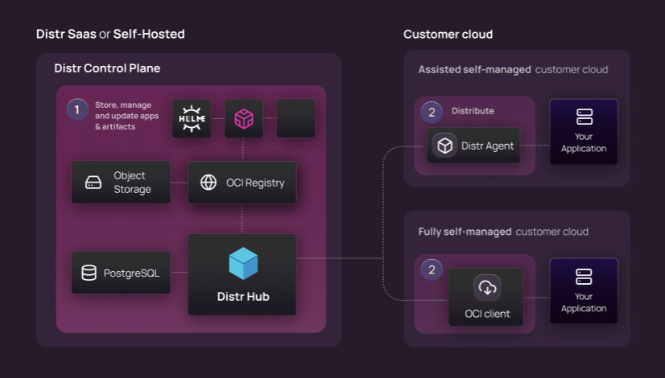

[Distr](https://distr.sh/) is an Open Source software distribution platform designed for Software and AI companies delivering applications across multiple deployment scenarios. Distr enables software distribution to fully customer-controlled environments ([self-managed](https://glasskube.dev/glossary/self-managed-software/)), customer-owned but vendor-managed clouds ([BYOC](https://glasskube.dev/glossary/byoc-definition/)), high-security [air-gapped](https://glasskube.dev/glossary/air-gapped-meaning/) systems, and vendor-managed private clouds. 

## Multiple Distribution Models

Distr offers multiple approaches to software distribution, adapting to different customer environments and security requirements:

### Registry-Based Distribution
For environments with strict isolation requirements, Distr's registry-based model enables vendors to publish applications to a secure registry. Customers can then pull these applications according to their security protocols and schedule.

### Assisted Self-Managed
For environments where deployment assistance is needed, Distr can directly deploy and manage applications using lightweight agents. These agents pull application definition files from Distr's central database (not an artifact registry) and handle deployment operations, providing real-time visibility to vendors.

### BYOC (Bring Your Own Cloud)
For customers who prefer to use their own cloud accounts but want vendor-managed operations, Distr supports BYOC deployments. Vendors can deploy and manage applications in customer-owned cloud infrastructure, maintaining control while respecting resource boundaries.

### Air-Gapped Deployments
For maximum security environments with no external network connectivity, Distr provides air-gapped deployment options. Updates can be delivered via physical media with cryptographic verification, ensuring security while maintaining software currency.

## Key Value Propositions

- **Flexible Distribution**: [Multiple approaches](docs/use-cases/fully-self-managed/) to fit any security requirement
- **Accelerated Onboarding**: Reduce time-to-value for new customers
- **Streamlined Updates**: Manage application lifecycles across diverse deployment scenarios
- **Centralized Monitoring**: Track deployment status, versions, and health metrics
- **License Management**: Enforce and track software licensing across deployments
- **Multiple Package Formats**: Support for Docker Compose, Helm charts and any OCI-compliant artifact.
- **Deployment Flexibility**: From cloud to completely isolated environments

Distr enables vendors to deliver SaaS-like experiences for applications that need to run in customer-controlled environments, without compromising on security or functionality.
