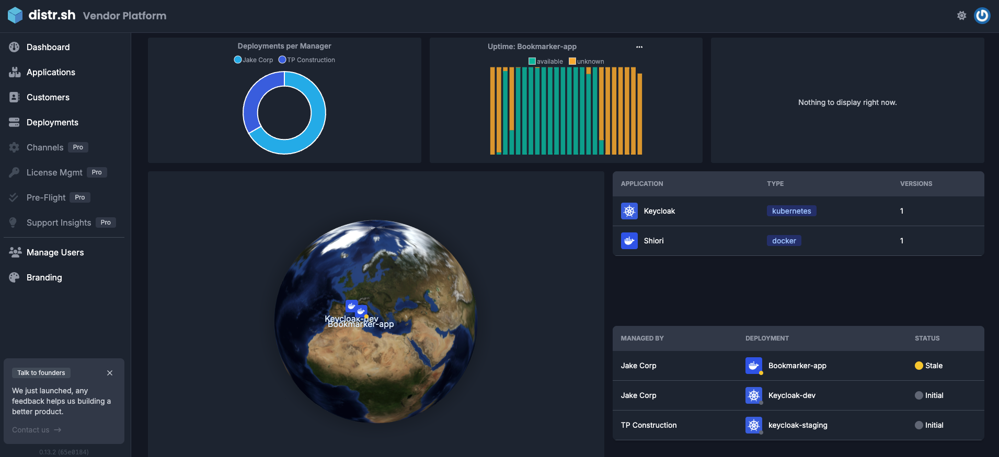

import {Aside} from '@astrojs/starlight/components';
import MermaidDiagram from '../../../../components/MermaidDiagram.astro';

## Flexible Architecture

Distr offers multiple architectural approaches to software distribution and management, adapting to different customer environments and security requirements.

<MermaidDiagram 
  chart={`
graph TD
    DH[Distr Hub] --- DR[Distr Registry]
    DH --- AP[Application Definitions]
    
    %% Registry-based path
    DR -.-> AG1[Gateway/Physical Media]
    AG1 --> CR[Customer Registry]
    CR --> DEV1[Development]
    CR --> STG1[Staging]
    CR --> PROD1[Production]
    
    %% Agent-based path
    AP --> AG2[Deployment Agents]
    AG2 --> DEV2[Development]
    AG2 --> STG2[Staging]
    AG2 --> PROD2[Production]
    
    subgraph "Customer Environment - Registry Based"
    AG1
    CR
    DEV1
    STG1
    PROD1
    end
    
    subgraph "Customer Environment - Agent Based"
    AG2
    DEV2
    STG2
    PROD2
    end

    style DH fill:#f9f,stroke:#333,stroke-width:2px
    style DR fill:#bbf,stroke:#333,stroke-width:2px
    style AP fill:#bbf,stroke:#333,stroke-width:2px
    style AG1 fill:#fbb,stroke:#333,stroke-width:2px
    style AG2 fill:#fbb,stroke:#333,stroke-width:2px
    style CR fill:#bfb,stroke:#333,stroke-width:2px
`}
/>

### Core Components

1. **Distr Hub**: The central platform where vendors manage all aspects of their application distribution:
   - Application versioning and metadata management
   - Customer access control and license management
   - Deployment monitoring and status tracking

2. **Distribution Methods**:
   
   a. **Registry-Based Distribution**:
   - **Distr Registry**: Repository for application artifacts
   - **Gateway/Physical Media**: Connection methods varying by security requirements
   - **Customer Registry**: Local storage in customer environment
   
   b. **Agent-Based Distribution**:
   - **Application Definitions DB**: Central storage for deployment configurations
   - **Deployment Agents**: Lightweight components that pull configurations and handle deployments

This flexible architecture allows Distr to adapt to various customer requirements, from fully connected to air-gapped environments, without sacrificing functionality.

## Two Portals, One Platform

The Distr platform was designed with [ISVs in mind](https://glasskube.dev/blog/5-ways-to-succeed-without-access-to-customer-environments/), prioritizing their success by ensuring end customers are satisfied. To achieve this, the platform includes two distinct control consoles.

Upon signing up, ISVs are greeted with the default view: the **"Vendor Portal"**. This console allows ISVs to manage their application registry, onboard customers, and monitor deployments. When an ISV invites a customer, they receive access to the **"Customer Portal"** - a streamlined interface focused only on the applications they've licensed.

The Customer Portal takes a "less is more" approach, offering only the essential features customers need to manage the applications they've purchased.

ISVs can white-label the Customer Portal to align with their branding, creating a seamless extension of their product suite.

## Programmatic access

In addition to the graphical user interfaces, Distr provides programmatic access for users and developers.

### Distr API

The [Distr API](/docs/integrations/api/), allows users to bypass the GUI for direct programmatic interaction. The API used in Distr is the same as the Open Source version, ensuring feature parity between the SaaS platform and the API. This guarantees a consistent experience regardless of the access method chosen.

### Distr SDK

The [Distr SDK](/docs/integrations/sdk/) enables users and developers to embed Distr's application management features directly into their own applications or to even write new applications that leverage the SDK. While SDK development runs in parallel with Distr development, there may be occasional gaps in feature parity due to development speed and the impracticality of implementing certain platform-specific features in the SDK. Nevertheless, the SDK provides a powerful way to integrate Distr functionality into your workflows, and we encourage you to explore its capabilities.

<Aside type="note">
  For more in-depth information on both the Distr API and SDK, head over to the
  Developer Tools section of the docs.
</Aside>

<Aside type="tip">
  Ready to get started? Create your Distr account
  [here](https://glasskube.cloud/signup.html) and follow the onboarding
  steps to set up your first application distribution.
</Aside>
