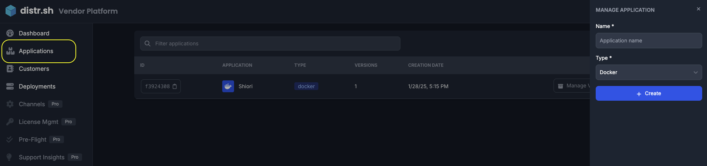
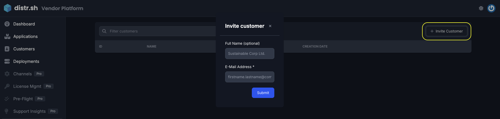
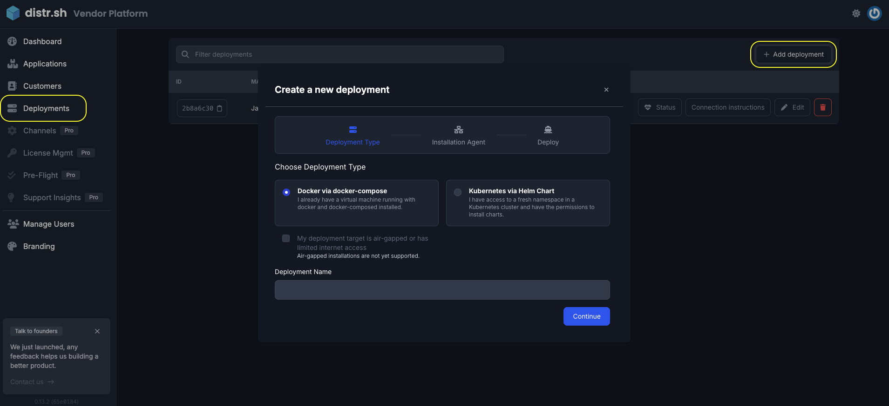

import {Aside} from '@astrojs/starlight/components';

## Overview of Distr Use Cases

Distr supports five distinct deployment models to meet different customer requirements:

- **[Fully Self-Managed](/docs/use-cases/fully-self-managed/)**: For customers who maintain complete control over their infrastructure with no vendor agents, using Distr Registry for artifact delivery.
- **[Assisted Self-Managed](/docs/use-cases/assisted-self-managed/)**: Balances customer infrastructure control with vendor-provided deployment agents that simplify updates and maintenance.
- **[Bring Your Own Cloud (BYOC)](/docs/use-cases/byoc/)**: Fully vendor-managed deployments within customer-owned cloud subscriptions, ideal for regulatory compliance.
- **[Air-Gapped Environments](/docs/use-cases/air-gapped/)**: For high-security scenarios with physical or logical network isolation, offering secure artifact delivery through whitelisted connections or physical media.
- **[Edge Deployments](/docs/use-cases/edge-deployments/)**: For vendor-controlled deployments to decentralized edge locations, IoT devices, or specialized hardware.

Each model leverages Distr's flexible architecture to provide the right balance of control, security, and operational efficiency.

## Prerequisites

<Aside type="tip">
  Don't have an application ready? No problem! You can follow the tutorials and ship a sample app to learn the platform. Distr provides test applications that let you explore all features without setting up your own app first.
</Aside>

If you're ready to distribute your own application with Distr, it should be:
- **Containerized** (Docker or Helm)
- Using **consistent versioning**
- Have **standardized dependencies**

For more details on preparing your application, see our [self-managed readiness guide](https://glasskube.dev/white-paper/building-blocks/).

## Where to start
### Getting Started with Platform Tutorials

The fastest way to learn Distr is through the interactive tutorials available directly on the platform. When you first create an account, you'll have access to three guided tutorials that cover the core capabilities:

### 1. Registry Configuration Tutorial

This tutorial guides you through:
- Setting up your registry slug
- Understanding how the registry works
- Pushing and pulling artifacts
- Managing registry access

The registry is a key component for distributing your applications, especially for air-gapped environments.

### 2. Deployment Agent Tutorial

Learn how to:
- Download and install the Distr agent
- Deploy a sample application
- Monitor deployment status
- Update applications through the agent

The deployment agent connects customer environments to Distr, enabling seamless application management.

### 3. Branding Customization Tutorial

Customize the customer experience by:
- Adding your company logo
- Customizing the color scheme
- Personalizing welcome messages
- Creating a seamless brand experience

Your customers will see your brand, not Distr, creating a consistent experience.

## Accessing the Tutorials

To access these tutorials:

1. Create your **free** [Distr account](https://distr.sh/)
2. Navigate to the Dashboard
3. Look for the "Tutorials" section
4. Select the tutorial you want to complete

<Aside type="note">
  You can complete the tutorials in any order, but we recommend starting with the Deployment Agent tutorial to quickly see Distr in action.
</Aside>

## After Completing Tutorials

After completing the platform tutorials, you'll be ready to:

1. **Onboard Your Applications**: Add your Docker Compose or Helm chart-based applications to Distr
2. **Invite Customers**: Bring your customers into your branded portal
3. **Create Deployments**: Set up application deployments for different environments
4. **Manage Licenses**: Control access to applications and versions

### Adding More Applications

Head over to the `Applications` tab and in the top right corner click on the `+ Add Application` button.

### Inviting Customers

Head over to the `Customers` tab and in the top right corner click on the `+ Invite customer` button.

<Aside type="caution">
  When you invite a customer, they'll receive login credentials for your branded Customer Portal, where they can view and manage their deployments.
</Aside>

### Creating Deployments

Head over to the `Deployments` tab and click on the `+ Add deployment` button.

- For Docker applications, check out this [guide](/docs/guides/onboarding-a-docker-app/)
- For Helm applications, check out this [guide](/docs/guides/onboarding-a-helm-app/)

### Managing Licenses

Associate specific applications and versions with customer licenses. For full details, check out the [License Management guide](/docs/guides/license-mgmt/).

<Aside type="tip">
  Need more help? Join our [Community Slack](https://distr.sh/slack) for assistance from our team and other Distr users.
</Aside>
