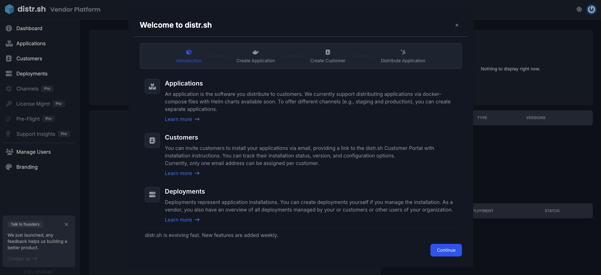
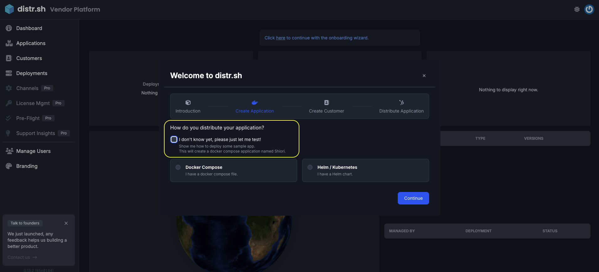
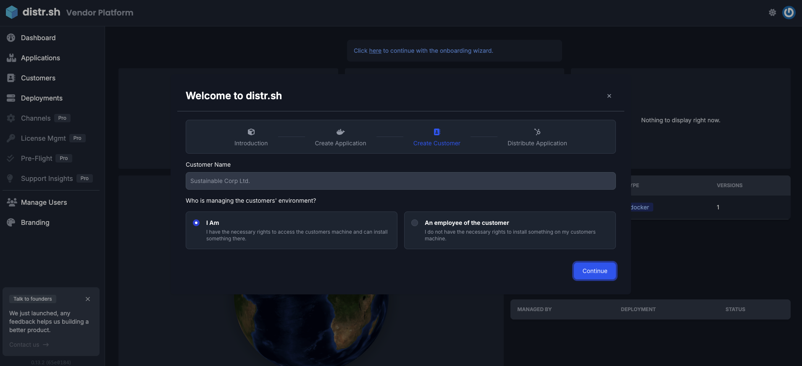
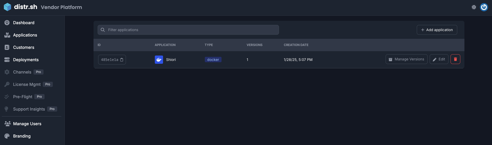
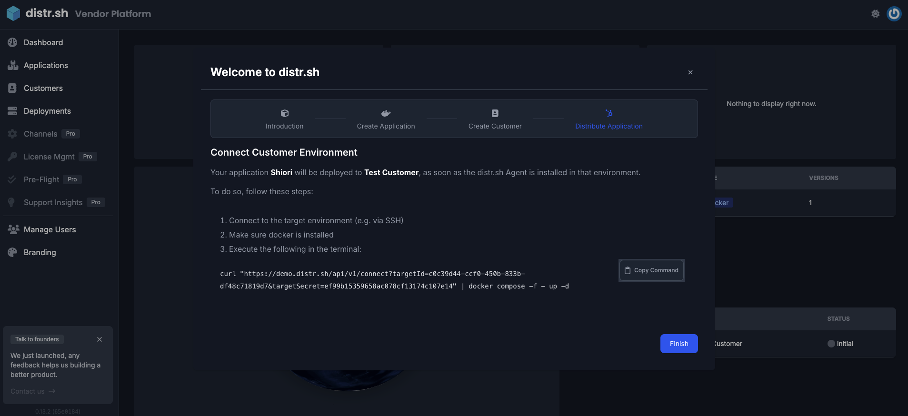
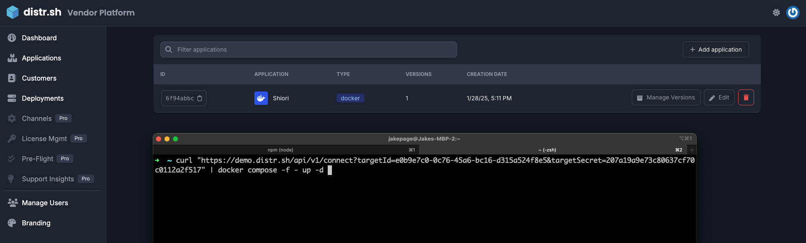
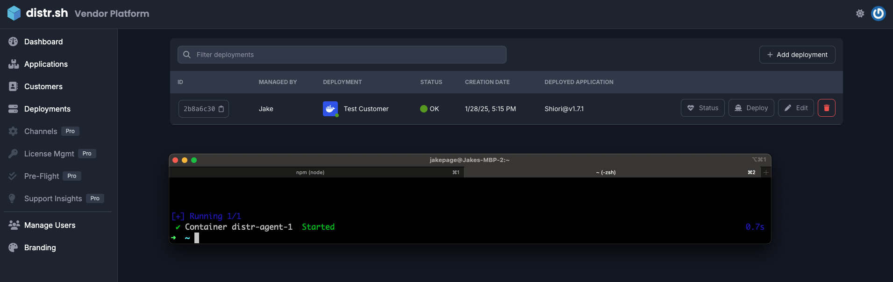
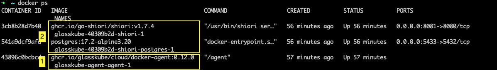
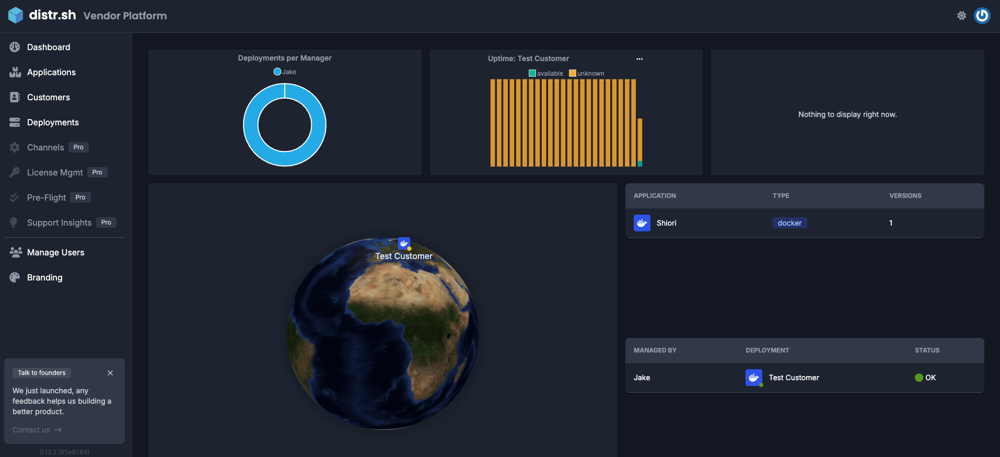

import {Aside} from '@astrojs/starlight/components';

## Prerequisites

Distr is designed to help distribute "on-prem" ready software to [customer-controlled environments](https://glasskube.dev/blog/5-ways-to-succeed-without-access-to-customer-environments/). The key phrase here is ["on-prem ready"](https://glasskube.dev/white-paper/building-blocks/).

### What does "on-prem ready" mean?

#### On-prem ready checklist:

- Your application is **fully containerized** (Docker or Helm)
- You are using some sort of **consistent versioning**
- If your application has dependencies, these should also be **standardized and declared**

If you're an ISV who has developed a SaaS product and later been approached by a customer requesting to use your product "on-prem," you’ve likely experienced the challenges of lacking on-prem readiness. Deploying to on-premises, self-hosted, or complex customer-controlled environments requires deliberate decisions and architectural considerations made early in the development process to ensure such deployments are practical.

Software built with on-prem readiness in mind from the start often reflects thoughtful design, focusing on maintainability and configurations suitable for future on-prem use cases. However, many software solutions aren’t initially created with these scenarios in mind. As customer requirements evolve, SaaS products may need adjustments to support on-prem deployments. Ideally, your application should already be containerized, with a Docker Compose file or Helm chart prepared. If not, feel free to reach out for white-labeled onboarding assistance.

#### What changes are needed for on-prem readiness?

To bridge this gap, we've compiled a document outlining the foundational building blocks for achieving on-prem readiness. You can access this comprehensive [whitepaper here](https://glasskube.dev/white-paper/building-blocks/).

## Quickstart

In this Quickstart guide, we’ll walk through the primary workflow designed to help Distr users get the most value from the platform. Here’s what we’ll cover:

- Open your **free** [Distr account](https://distr.sh/).
- **Onboarding a sample application** to explore how Distr works.
- **Choosing a deployment target setup**:
- Onboard your first customer, or
- Assign yourself as the owner of the deployment target environment.
- **Creating a deployment** and verifying its installation using the Distr agent.

All of this can be easily accomplished by following the helpful Onboarding Wizard. Let’s get started!

## Follow the onboarding wizard to get started

<Aside type="note">
  The Onboarding Wizard will only appear if your Distr account has not yet
  created its first application, customer, or deployment. If you’ve already used
  the Onboarding Wizard but would like to add more applications, customers, or
  deployments, please follow these
  [instructions.](#onboard-more-applications-customers-and-deployments)
</Aside>

### Onboarding Wizard

The Onboarding Wizard is a step-by-step guide that assists Distr users in uploading an application based on a Docker Compose file or a Helm chart, onboarding a customer if one is available, and adding a deployment that will be installed by the Distr agent.

<Aside type="note">
  The Onboarding Wizard also offers the option to onboard a sample app for
  testing purposes. To gain a better understanding of how Distr works, we'll
  begin by onboarding the [test app](https://github.com/go-shiori/shiori).
</Aside>

### Let's Onboard a Sample Application

Upon clicking "Continue" on the initial Onboarding Wizard screen, you'll be prompted to choose the type of app definition files you'd like to onboard. Distr users can select either Docker Compose files or Helm charts. Alternatively, you can click the "I don't know yet, please just let me test!" checkbox (shown in the image below) to deploy a sample bookmarking app, which is based on a Docker Compose file.

At this stage, Distr handles the process of locating the app definition file, exposing the application version and preparing it for distribution.

### Define Ownership of Target Environment

Next, you'll move to the stage where users are prompted to choose a name and define who is responsible for the target environment where the application will be deployed. Deployment targets can either be managed by the end-customer or directly by the Distr user. At this step, you'll find two checkboxes to choose from:

-- **"I Am"**: Select this if you are responsible for and have control over the deployment target, such as for IoT, edge, or internal use cases.
-- **"An employee of the customer"**: Select this when the end-user's team is responsible for managing deployments, and the Distr user does not have access to the deployment target. More suited towards On-prem and end-customer hosted use cases.

<Aside type="note">
  Once you click `Continue`, Distr will create a deployment named
  `Test-Customer`. Since the target deployment environment hasn't been connected
  yet, the deployment status will appear in the gray `initial` stage. To
  complete the process and make the deployment of our test app healthy, we'll
  need to connect the target environment to Distr.
</Aside>

Deployment with status: `initial`

### Connect the Target Environment with the Distr Agent

To complete the final step and connect the target environment to Distr, you'll need to access the target environment and run the curl command displayed in the Onboarding Wizard console. In this test case, the agent will be installed in a local Docker Desktop environment. So make sure to have access to a local Docker desktop instance.

Once the agent is installed, it will pull the deployment specifications and install the deployment into the target environment. After installation, the agent will communicate with the Distr hub to confirm that the deployment is up and running. This will update the status on the deployment page to `"OK"`.

Run the Distr agent in the target environment:

<Aside type="tip">
  If you are running the agent on macOS, make sure to checkout the [macOS setup
  guide](/docs/guides/distr-on-macos/) for additional steps.
</Aside>

### The Test Deployment is Operational

Check in the "Deployments" tab, to see if the test deployments health is _green_.

Deployment with status: `OK`

As mentioned earlier, the test bookmarking app is packaged in a Docker Compose file and runs locally on Docker Desktop. You can verify the deployment by checking the running Docker containers.

To do this, run the command `docker ps` to view the active containers in your Docker environment.

Here's what you'll find:

1. The Distr agent was installed first.
2. The agent then deployed two additional containers:

- The Shiori app
- The Shiori app's database container

You can also navigate to the main Dashboard page, where the widgets will update to display the latest uptime and deployment metrics currently available.

## Onboard more applications, customers and deployments.

Distr users will only see the Onboarding Wizard once, and only if no applications have been onboarded. After completing the onboarding process by adding their first application, customer, and running the first deployment, all of these steps can be repeated individually as needed.

### Add More Applications

Head over to the `Applications` tab and in the top right corner click on the `+ Add Application` button. And simply follow the steps.

### Invite More Customers

Head over to the `Customers` tab and in the top right corner click on the `+ Invite customer` button. And simply follow the steps.

<Aside type="caution">
  Once the customer's email address is submitted, the recipient will receive an
  email containing login credentials for the Distr Customer Portal. Through this
  portal, they can view and manage the deployments of the applications they have
  purchased from the ISV.
</Aside>

### Add More Deployments

Head over to the `Deployments` tab and click on the `+ Add deployment` button and follow the steps.

- For more information on how to deploy a Docker compose packaged application, check out this [guide](/docs/guides/onboarding-a-docker-app/).
- For more information on how to deploy a Helm chart packaged application, check out this [guide](/docs/guides/onboarding-a-helm-app/).

### Create your first software license

Easily manage customer access by associating specific applications and application versions with a license. Give the license a name, set an expiration date, and gain granular control over what each customer can access.

For full details, check out the [License Management guide](/docs/guides/license-mgmt/).