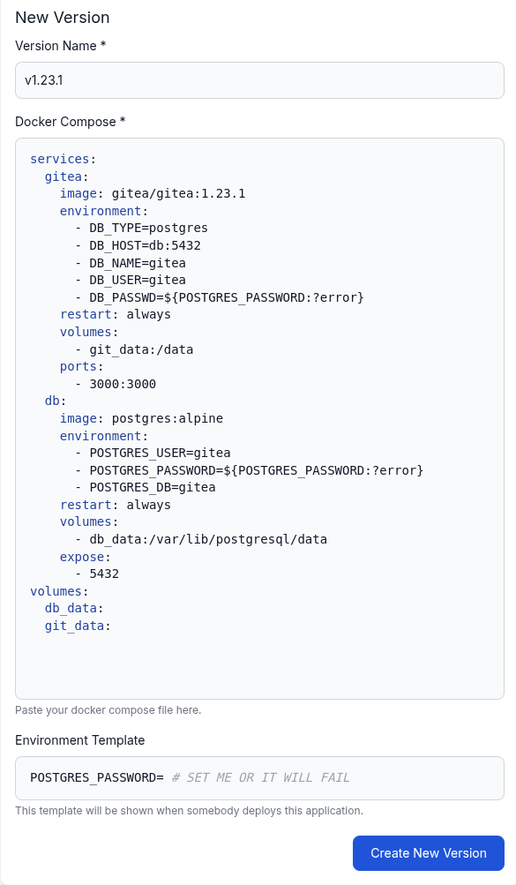

import {Tabs, TabItem} from '@astrojs/starlight/components';

This guide walks you through creating applications in Distr. You can create two types of applications: **Docker** applications (using Docker Compose) and **Helm** applications (using Kubernetes Helm charts).

## Creating a new Application

In the Distr web interface, navigate to the **Applications** section in the sidebar and click on the **Add application** button in the top right corner.

You will be asked to enter a name and select the type of the application (Docker or Kubernetes/Helm).

<Tabs>
  <TabItem label="Docker">

### Prerequisites

In Distr, a Docker app consists of versions, each defined by a [Docker Compose](https://docs.docker.com/compose/) file.
Therefore, if you want to onboard a new Docker App, you need to have a Docker Compose file of your software ready.

### Creating a new Docker App

In the Distr web interface, navigate to the **Applications** section in the sidebar and click on the **Add application** button in the top right corner.

You will be asked to enter a name and select the type of the application:

After you have clicked on the **Create Application** button, you will be redirected to the detailed view of this application.
In this view you can manage the versions of the application.

### Creating a first version

To add a first version to your Docker App, enter the version name and your Docker Compose file in the "New Version" form.
In this example we will upload a file containing Gitea and a Postgres database,
whose source can be found [here](https://github.com/docker/awesome-compose/blob/master/gitea-postgres/compose.yaml) (we additionally pin the version to `1.23.1`
and make the password an environment variable).

You can optionally add a template for the environment variables that your Docker Compose file uses.
The template will be shown to the user when they deploy this version to a deployment environment.
In this example we enter a reminder for the user to set the database password, as the deployment would fail otherwise.

Click on the **Create New Version** button to add the version to your Docker App.

### Adding further versions

After you have created the version, you can see it in the list of versions:

You can use the **Copy from** button to create a new version based on the existing one.

If you are looking for a more automated and integrated experience in creating new versions,
take a look at our [GitHub Action](/docs/integrations/gh-action/) or [SDKs](/docs/integrations/sdk/).

  </TabItem>
  <TabItem label="Helm">

### Prerequisites

In Distr, a Helm app consists of versions, each defined by a publicly available [Helm chart](/glossary/helm-chart/).
Therefore, if you want to onboard a new Docker App, you need to have a Helm chart of your software ready.

You should also have access to a [Kubernetes](/glossary/kubernetes/) cluster and a namespace where you can deploy the Helm chart.

### Creating a new Helm App

In the Distr web interface, navigate to the **Applications** section in the sidebar and click on the **Add application** button in the top right corner.

You will be asked to enter a name. Change the type of the application **Kubernetes**:

After you have clicked on the **Create** button, the list of applications will show your new app.

### Creating a first version

To add a new version to your Helm App, click on the **Manage versions** button in the application list.

A modal will open where you can add a new version by entering a name and the corresponding data about the Helm chart:

**Base Values and Template**

You can provide a base values file and a template file for the [Helm chart](/glossary/helm-chart/).
The base values file is a YAML file that contains the default values for the Helm chart.
The template file is a file that contains the template for the Helm chart.

The template will also be shown later on in the deployment process, so the user can adjust the values before deploying the Helm chart.

Both files are optional.

Click on the **Create** button to add the version to your Helm App.

### Adding a new version

After you have created the version, you can see it in the list of versions:

You can use the **Copy from** button to create a new version based on the existing one.

If you are looking for a more automated and integrated experience in creating new versions, take a look at our [SDKs](/docs/integrations/sdk/).

  </TabItem>
</Tabs>

## Next Steps

Once you've created your application and added versions, you're ready to create deployments. See the [Create Deployment](/docs/guides/create-deployment/) guide for instructions on deploying your applications to customer environments.
