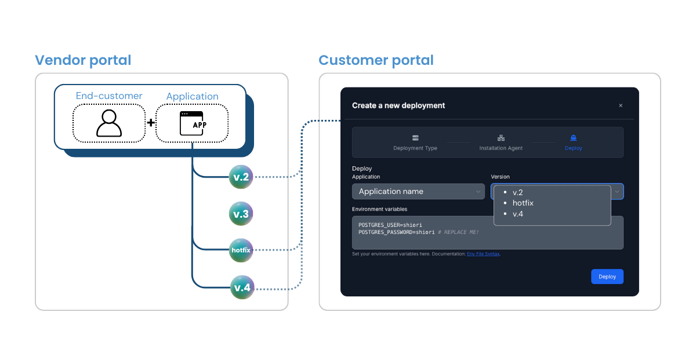
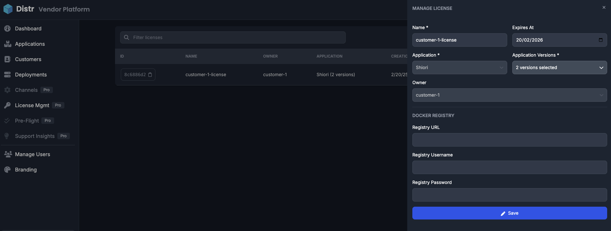
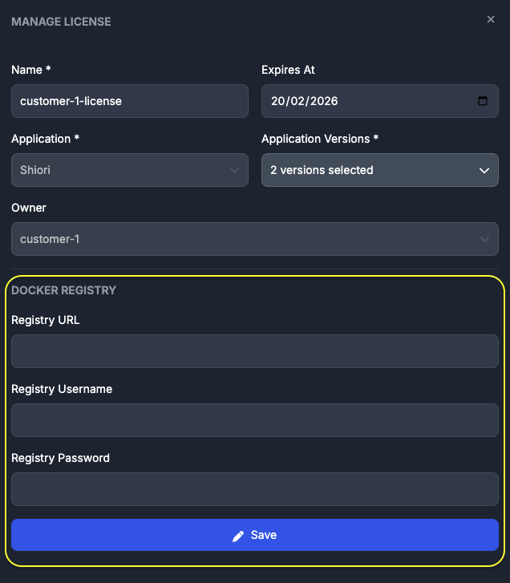
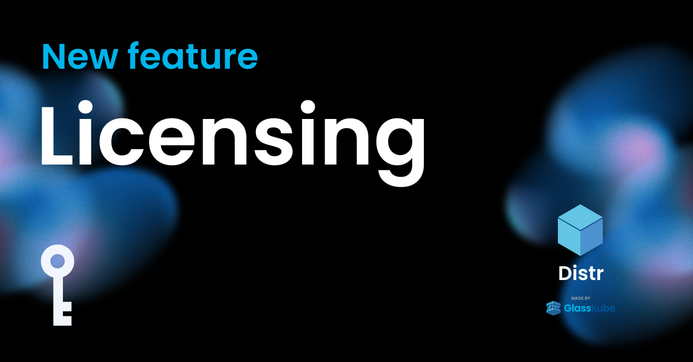

import {Aside, Code, TabItem, Tabs} from '@astrojs/starlight/components';

This guide walks you through how to use Application Licenses to control which application versions your end-customers can access and deploy through Distr agents.

<Aside type="note">
  Application Licenses are a Pro feature available in Pro, Enterprise, and Pro
  Trial plans. Learn more about [License
  Management](/docs/product/license-management/) and [subscription
  plans](/docs/product/subscription-management/).
</Aside>

With Application Licenses, you can link a license to a customer, allowing access to specific application versions, whether it's one, a select few, or all available versions. You can name the license, set an expiration date, and assign it to a particular customer, giving you granular control over which applications and versions each end-customer can use.

## License flow diagram

<Aside type="note">
  The diagram above illustrates how a license links an end-customer account to a
  specific set of application versions. Once the license is active, the customer
  will only be able to see and can only deploy the granted versions of the
  application.
</Aside>

## Use case

Many vendors offer tiered pricing plans with different features and functionality. For those serving [on-premises](/glossary/on-premises-definition/) environments, granular control over version access is crucial, whether it's delivering a specific feature set, pointed hotfixes to select customers or offering early access to new application versions. This level of precision is exactly what Application Licenses deliver.

## License features

1. Each license is linked to a single `customer/application` pairing.
2. Each license grants a customer access to one or multiple application versions.
3. Once an application version has been granted via a license, it can't be revoked (currently working on the version revoking functionality).
4. A customer can be associated to multiple licenses.
5. License edits are reflected in the customer portal in real time.

## How to use it

If you don't see the feature yet, make sure you're on a Pro plan or Pro Trial. Once you're in, here's how it works:

1. **Create a customer:** If none exist, create a customer first
2. **Navigate to the "Licenses" tab** in the sidebar, then select **"Application Licenses"**
3. **Click "Create License"**
4. **Give it a name**
5. **Set an expiration date** (optional)
6. **Assign to an application**
7. **Choose the version/s of the app** you would like to grant the customer access to
8. **Link it to a customer**
9. **Save:** Hit "Save" and you're done!

The customer can now access and deploy the assigned application version/s directly from their [customer portal](/docs/product/customer-portal/).

## OCI registry authentication

If your images are stored in a private [OCI registry](/glossary/oci-container-artifact-registry/), you'll need to provide access credentials. You can configure these credentials in the lower section of the license configuration panel. Once set, the application versions will be available at the deployment target for as long as the license is valid.

## Licensing walkthrough video

