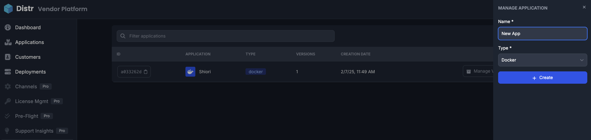
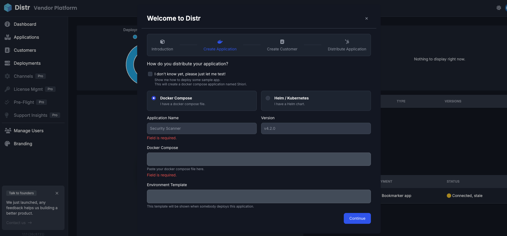
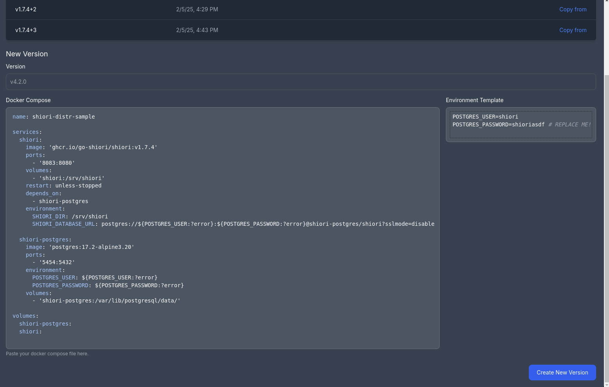
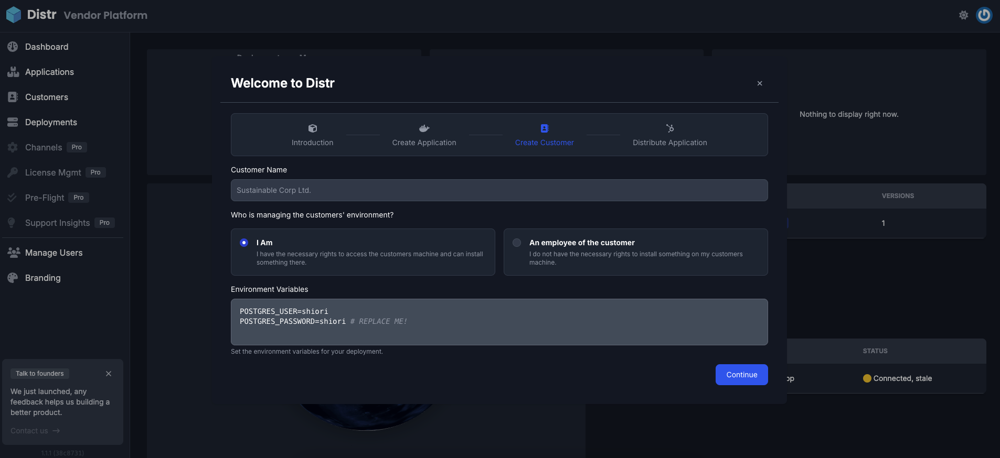

Distr allows users to define environment variable templates for Docker applications. Users can configure and customize environment variables before deploying an application, ensuring flexibility and ease of management.

In this guide, we will walk you through the process of onboarding a new **Docker Compose** application in Distr and using environment variable templates to customize its configuration.

## Prerequisites

To onboard a new Docker application, you will need:

- A valid `docker-compose.yml` file for your application.
- A set of configurable environment variables that users may need to adjust before deployment.
- Access to Distr’s web interface to manage applications and deployments.

## What is an Environment Variable Template?

Similar to how [Helm](https://glasskube.dev/blog/what-is-helm-in-kubernetes/) charts use parameters to allow dynamic value assignment, Docker applications can achieve the same flexibility with **environment variable templates**.

This setup consists of two parts:

1. A **parameterized Docker Compose file** that references dynamic variables.
2. A **template file** that provides default values for those variables, allowing end users to modify them in Distr before deployment.

Here’s an example of how it works:

<div style="display: flex; gap: 20px;">
  <div style="width: 50%;">
    <pre>
      <code>
# Parameterized Docker Compose file
version: '3.8'
services:
  web:
    image: "${WEB_IMAGE}"
    container_name: "${WEB_NAME}"
    ports:
      - "${WEB_PORT}:80"
    environment:
      - APP_ENV=${APP_ENV}
      </code>
    </pre>
  </div>
  <div style="width: 50%;">
    <pre>
      <code>
# Environment Variable Template
WEB_IMAGE=nginx:latest
WEB_NAME=my-nginx-container
WEB_PORT=8080
APP_ENV=development
      </code>
    </pre>
  </div>
</div>


## Creating a New Docker Application

1. **Navigate to Applications**: In the Distr web interface, go to the **Applications** section in the sidebar and click on **Add Application**.
2. **Enter Application Details**:
   - Provide a name for your application.
   - Select **Docker** as the application type.
   - Click **Create** to add the application.



> Only once the application is created will you then add the Docker compose file and env var template by [adding a new version](/docs/guides/docker-env-var-template/#adding-a-new-version).

## Creating a New Docker Application with the Onboarding Wizard

> You will only be prompted to follow the [Onboarding Wizard](/docs/getting-started/quickstart/#follow-the-onboarding-wizard-to-get-started) if no other applications have been added to Distr.

1. Open the onboarding wizard form and add the application files. 
2. Here you can directly add the Docker compose file as well as the template in the same form



Once the application is created, you will see it listed under your available applications.

## Adding a New Version

1. **Navidate to Applications** and click on the **Manage Versions** button in the application list.
2. In the version creation modal:
   - Enter a version name (e.g., `v1.0.0`).
   - Paste your `docker-compose.yml` file into the provided field.
   - Add an [environment variable template](http://localhost:4321/docs/guides/docker-env-var-template/#defining-environment-variable-templates) on the right.
   - Click **Create New Version** to save the version.



## Defining Environment Variable Templates

When adding a version, you can specify environment variables that will be presented as configurable fields during deployment.

1. **Navigate to the Environment Template Section**:
   - Add environment variables that should be customizable, for example:

     ```plaintext
     POSTGRES_USER=shiori
     POSTGRES_PASSWORD=shioriasdf  # REPLACE ME!
     ```

   - These variables will be shown to users before deployment, allowing them to modify the values.

2. **Save the Version**: Click **Creat New Version** to finalize the version with the configured environment variable template.

## Deploying a Docker Application

To deploy an application with environment variables:

1. **Go to the Deployments Section** in the sidebar and click on **Add Deployment**.
2. **Choose a Deployment Target**:
   - Select an existing deployment target or create a new one.
3. **Customize Environment Variables**:
   - Before deployment, users will see the predefined environment variable fields.
   - They can adjust values according to their needs before proceeding.
4. **Confirm Deployment**: Click **Deploy** to initiate the process.



## Verifying Deployment Status

After deployment, check the status of your application:

- Navigate to the **Deployments** section.
- View the **Status** to ensure successful deployment.
- Logs can be accessed for troubleshooting if needed.

## Give it a go

The **Environment Variable Template** feature in Distr enhances the flexibility of Docker applications by allowing users to modify key configuration values before deployment. This ensures that applications are deployed with the correct settings without needing manual edits to `docker-compose.yml` files.
