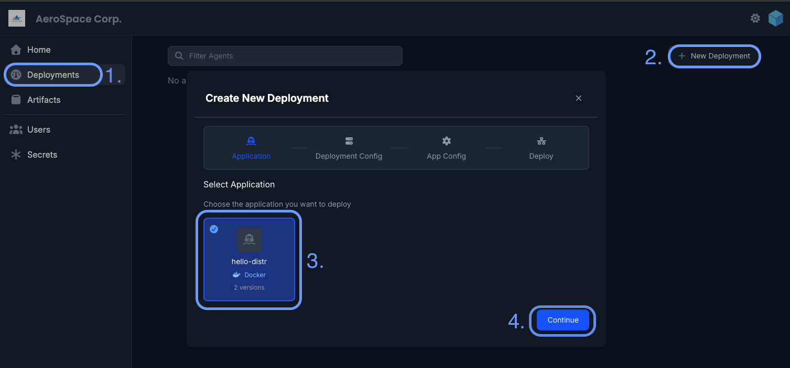
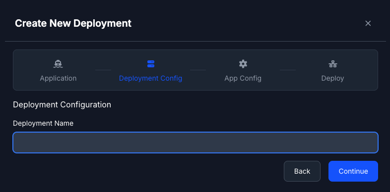
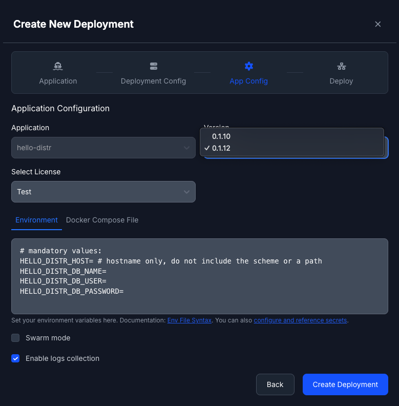
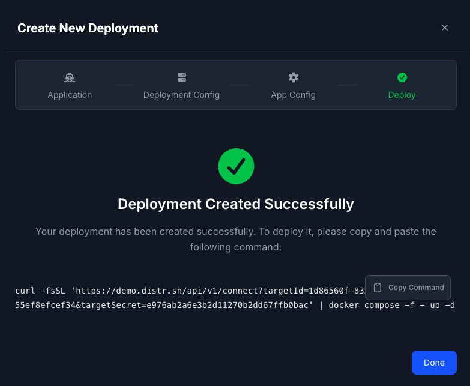

import {Aside, Code} from '@astrojs/starlight/components';
import ThemedImage from '~/components/util/ThemedImage.astro';
import customerPortalLight from '~/assets/docs/guides/customer-view/customer-portal-no-num-light.png';
import customerPortalDark from '~/assets/docs/guides/customer-view/customer-portal-no-num-dark.png';
import artifactUICustomerLight from '~/assets/docs/guides/customer-view/artifact-ui-customer-light.png';
import artifactUICustomerDark from '~/assets/docs/guides/customer-view/artifact-ui-customer-dark.png';
import artifactUIDetailsLight from '~/assets/docs/guides/customer-view/artifact-ui-details-light.png';
import artifactUIDetailsDark from '~/assets/docs/guides/customer-view/artifact-ui-details-dark.png';
import customerAgentNameLight from '~/assets/docs/guides/customer-view/customer-agent-name-light.png';
import customerAgentNameDark from '~/assets/docs/guides/customer-view/customer-agent-name-dark.png';
import helmNSLight from '~/assets/docs/guides/customer-view/helm-ns-light.png';
import helmNSDark from '~/assets/docs/guides/customer-view/helm-ns-dark.png';
import configLight from '~/assets/docs/guides/customer-view/config-light.png';
import configDark from '~/assets/docs/guides/customer-view/config-dark.png';
import statusLight from '~/assets/docs/guides/customer-view/status-light.png';
import statusDark from '~/assets/docs/guides/customer-view/status-dark.png';
import logsLight from '~/assets/docs/guides/customer-view/logs-light.png';
import logsDark from '~/assets/docs/guides/customer-view/logs-dark.png';
import updateDeployLight from '~/assets/docs/guides/customer-view/update-deploy-light.png';
import updateDeployDark from '~/assets/docs/guides/customer-view/update-deploy-dark.png';

As an end customer, you will be given access to a [Customer Portal](/docs/product/customer-portal/) by the software vendor.
The portal you will have access to two key features:

- The artifact registry for downloading software distributed by your vendor
- The deployment section for managing applications with Distr agents.
  Depending on your use case, you might use only one or both of these features.

This guide walks you through using both of the features.

## Registry quickstart from the customer portal

A typical onboarding journey looks like this:

### 1. Access the Customer Portal Dashboard

Here you will view release notes and vendor-specific software information in your dashboard.

<ThemedImage
  lightSrc={customerPortalLight}
  darkSrc={customerPortalDark}
  alt="Deployments interface"
/>

### 2. View Available Artifacts

Browse the artifacts your vendor has made available to you in the artifacts section:

<ThemedImage
  lightSrc={artifactUICustomerLight}
  darkSrc={artifactUICustomerDark}
  alt="Registry artifacts view"
/>

In this example, the vendor made to a single artifact called hello-world available to the end-customer.

### 3. Explore Artifact Details

Click on the artifact name to see details like available versions, creation date, and a download counter:

<ThemedImage
  lightSrc={artifactUIDetailsLight}
  darkSrc={artifactUIDetailsDark}
  alt="Artifact details view"
/>

### 4. Authenticate with a Personal Access Token

Generate a [Personal Access Token (PAT)](/docs/integrations/personal-access-token/) in your Distr account and use it to log in:

```shell
echo "YOUR-ACCESS-TOKEN" | docker login registry.distr.sh:8585 --password-stdin -u -
```

### 5. Pull Vendor Artifacts

Once authenticated, you can pull the artifacts using Docker, [ORAS](https://oras.land/docs/installation) or Helm for example:

<Aside type="tip">
  You will find the exact commands in the Customer Portal.
</Aside>

```shell
docker pull registry.distr.sh/slug/hello-world:1.0.0
oras pull registry.distr.sh/slug/vendor-artifact:1.0.0
helm pull registry.distr.sh/slug/vendor-helm-chart:1.0.0
```

### 6. Deploy the Artifacts

Refer to the deployment instructions in your [Customer Portal](/docs/product/customer-portal/) dashboard or coordinate directly with your vendor for specific deployment guidance.

## Deployment Agent quickstart from the customer portal

### Step 1: Select Application

Navigate to **Deployments** in the sidebar and click on the **+ New Deployment** button.

Choose the application you want to deploy.



### Step 2: Deployment Configuration

Give your deployment a descriptive name. This name will help you identify and manage the deployment later.

For Helm applications, you'll also need to specify the Kubernetes namespace where it should be deployed. Make sure the namespace exists in your cluster before proceeding.



<Aside type="tip">
  You can also enable cluster-scoped permissions for Helm deployments. When
  enabled, the agent will have cluster-wide access; otherwise, it will be
  limited to a specific namespace. See [Helm
  Agent](/docs/product/agents/#helm-agent) for more details.
</Aside>

### Step 3: Application Configuration

Configure the environment variables for your Docker Compose application. These variables will be passed to the `docker compose` process via the `--env-file` argument.

The entered environment variables will be passed unmodified to the `docker compose` process via the `--env-file` argument.
For more information on how to use them, please refer to [our guide on working with environment variables](/docs/guides/docker-env-var-template/).

You can also enable Docker Swarm mode for deployments that should run in swarm mode. See [Docker Swarm](/docs/product/agents/#docker-swarm) for more details. Additionally, you can enable container log collection to view application logs directly in the portal. Learn more about [Container Logs](/docs/product/agents/#container-logs).

<Aside type="note">
  For Helm applications, you'll configure the Helm values instead. You can
  adjust the values from the base values file provided by the vendor when
  creating the application version.
</Aside>



### Step 4: Deploy

Review your configuration and click **Create Deployment** to proceed to the deployment page.



<Aside type="caution">
  **Important**: This command will automatically install the Distr agent, which
  will then automatically installs the application. The agent runs in the
  customer environment and manages the full lifecycle of your application
  deployment.
</Aside>

### 5. Monitor Deployment Status

View real-time updates as your deployment initializes.

<ThemedImage
  lightSrc={statusLight}
  darkSrc={statusDark}
  alt="Artifact details view"
/>

### 6. Access Environment Logs

Click on the status button to view application logs directly from the portal.

<ThemedImage
  lightSrc={logsLight}
  darkSrc={logsDark}
  alt="Artifact details view"
/>

### 7. Update Deployments

Modify configuration values and update running deployments as needed.

<ThemedImage
  lightSrc={updateDeployLight}
  darkSrc={updateDeployDark}
  alt="Artifact details view"
/>

## Important Notes

- A single agent can manage multiple deployments in the same target environment
- To remove a deployment, first **undeploy** it before **deletion**
