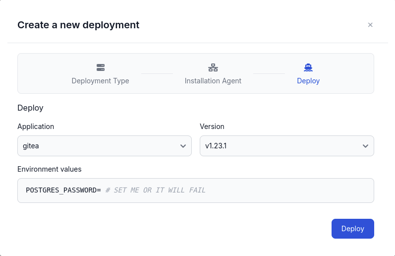

In this guide, we will walk you through the process of onboarding a new Docker App in Distr.

We will deploy a simple Docker Compose file containing Gitea and a Postgres database.
Please note that this is just an example and you can onboard any Docker App you like. Also, it is not a recommendation on how to deploy Gitea in production.

## Prerequisites

In Distr, a Docker app consists of versions, each defined by a [Docker Compose](https://docs.docker.com/compose/) file.
Therefore, if you want to onboard a new Docker App, you need to have a Docker Compose file of your software ready.

## Creating a new Docker App

In the Distr web interface, navigate to the **Applications** section in the sidebar and click on the **Add application** button in the top right corner.

You will be asked to enter a name. The default type of the application is **Docker** already:

After you have clicked on the **Create** button, the list of applications will show your new app.

## Creating a first version

To add a new version to your Docker App, click on the **Manage versions** button in the application list:

A modal will open where you can add a new version by entering a name and the corresponding Docker Compose file.
In this example, we will upload a file containing Gitea and a Postgres database,
whose source can be found [here](https://github.com/docker/awesome-compose/blob/master/gitea-postgres/compose.yaml) (we additionally pin the version to `1.23.1`
and make the password an environment variable).

You can optionally add a template for the environment variables that your Docker Compose file uses.
The template will be shown to the user when they deploy this version to a deployment environment.

Click on the **Create** button to add the version to your Docker App.

## Adding a new version

After you have created the version, you can see it in the list of versions:

You can use the **Copy from** button to create a new version based on the existing one.

If you are looking for a more automated and integrated experience in creating new versions, 
take a look at our [GitHub Action](/docs/integrations/gh-action) or [SDKs](/docs/integrations/sdk).

## Creating a new deployment

To deploy your Docker App into a target environment, that target environment needs to exist in the first place, and needs to be of type `docker` as well.

### Create a new deployment environment

You can onboard a new deployment environment by navigating to the **Deployments** section in the sidebar and clicking on the **Add deployment** button in the top right corner.

This will open a wizard that takes you through the process of creating a new deployment environment.

The first step is to choose the deployment type (in this case docker) and a name:

On the next screen, you will find the instructions to connect your deployment environment to Distr, by installing the agent:

As the last step, you can deploy your newly onboarded docker app to the new deployment environment, and set the specific environment variables:

**Environment Variables**

The entered environment variables will be passed unmodified to the `docker compose` process via the `--env-file` argument.
For more information on how to use them, please refer to the [official Docker documentation](https://docs.docker.com/compose/how-tos/environment-variables/).

### Use an existing deployment environment

If you already have a deployment environment of type `docker`, you can use it to deploy your Docker App.

Simply navigate to the **Deployments** section in the sidebar and click on the **Deploy** button of the environment you want to use.

This will show you the same screen as above, where you can select your application and version to deploy.

## Check if your deployment was successful

After you have installed the Distr agent and deployed your Docker App, you can check the status of your deployment in the **Deployments** section.
You can also see the status logs of the deployment by clicking on the **Status** button.
