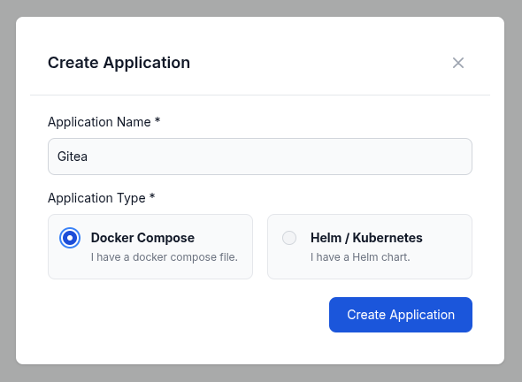

In this guide, we will walk you through the process of onboarding a new Docker App in Distr.

We will deploy a simple Docker Compose file containing Gitea and a Postgres database. 
Please note that this is just an example and you can onboard any Docker App you like. Also, it is not a recommendation on how to deploy Gitea in production.

## Prerequisites

In Distr, a Docker app consists of versions, each defined by a [Docker Compose](https://docs.docker.com/compose/) file.
Therefore, if you want to onboard a new Docker App, you need to have a Docker Compose file of your software ready.

## Creating a new Docker App

In the Distr web interface, navigate to the **Applications** section in the sidebar and click on the **Add application** button in the top right corner.

You will be asked to enter a name. The default type of the application is **Docker** already:

After you have clicked on the **Create** button, the list of applications will show your new app.

## Creating a first version

To add a new version to your Docker App, click on the **Manage versions** button in the application list:

A modal will open where you can add a new version by entering a name and the corresponding Docker Compose file. 
In this example, we will upload a file containing Gitea and a Postgres database, 
whose source can be found [here](https://github.com/docker/awesome-compose/blob/master/gitea-postgres/compose.yaml) (we did pin the version to `1.23.1`): 

Click on the **Create** button to add the version to your Docker App.

## Adding a new version

After you have created the version, you can see it in the list of versions:

You can use the **Copy from** button to create a new version based on the existing one.

If you are looking for a more automated and integrated experience in creating new versions, take a look at our [SDKs](/docs/integrations/sdk).
