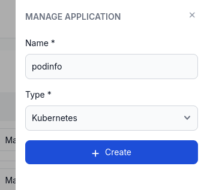
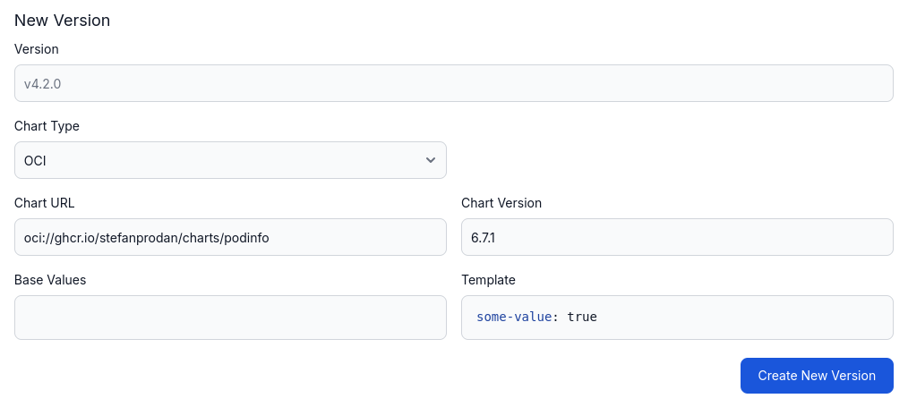
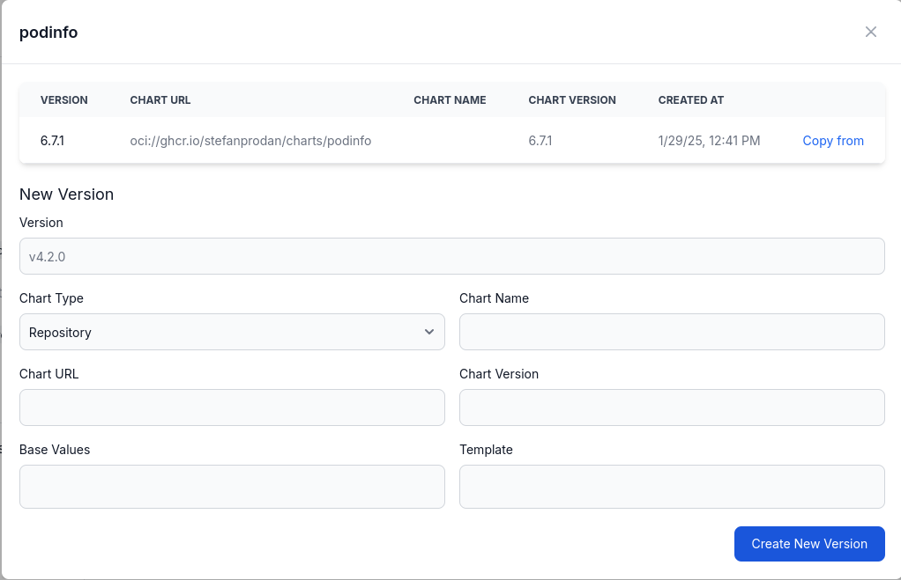
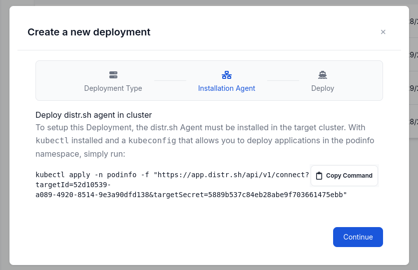
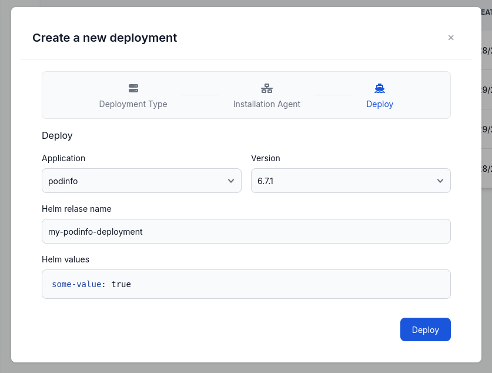

In this guide, we will walk you through the process of onboarding a new Helm (Kubernetes) App in Distr.

For demonstration purposes, we will deploy the [podinfo](https://github.com/stefanprodan/podinfo) chart.
Please note that this is just an example and you can onboard any Helm chart you like.

## Prerequisites

In Distr, a Helm app consists of versions, each defined by a publicly available Helm chart.
Therefore, if you want to onboard a new Docker App, you need to have a Helm chart of your software ready.

You should also have access to a Kubernetes cluster and a namespace where you can deploy the Helm chart.

## Creating a new Helm App

In the Distr web interface, navigate to the **Applications** section in the sidebar and click on the **Add application** button in the top right corner.

You will be asked to enter a name. Change the type of the application **Kubernetes**:

After you have clicked on the **Create** button, the list of applications will show your new app.

## Creating a first version

To add a new version to your Helm App, click on the **Manage versions** button in the application list.

A modal will open where you can add a new version by entering a name and the corresponding data about the Helm chart:

**Base Values and Template**

You can provide a base values file and a template file for the Helm chart.
The base values file is a YAML file that contains the default values for the Helm chart.
The template file is a file that contains the template for the Helm chart.

The template will also be shown later on in the deployment process, so the user can adjust the values before deploying the Helm chart.

Both files are optional.

Click on the **Create** button to add the version to your Helm App.

## Adding a new version

After you have created the version, you can see it in the list of versions:

You can use the **Copy from** button to create a new version based on the existing one.

If you are looking for a more automated and integrated experience in creating new versions, take a look at our [SDKs](/docs/integrations/sdk).

## Creating a new deployment

To deploy your Helm App into a target environment, that target environment needs to exist in the first place, and needs to be of type `kubernetes` as well.

### Create a new deployment environment

You can onboard a new deployment environment by navigating to the **Deployments** section in the sidebar and clicking on the **Add deployment** button in the top right corner.

This will open a wizard that takes you through the process of creating a new deployment environment.

The first step is to choose the deployment type (in this case `kubernetes`) and a name and the namespace, that the deployment should be created in:

On the next screen, you will find the instructions to connect your deployment environment to Distr, by installing the agent.
Make sure that the given namespace exists in your cluster, before executing the shown command:

As the last step, you can deploy your newly onboarded Helm app to the new deployment environment.
In this step you can also adjust the values of the Helm chart:

### Use an existing deployment environment

If you already have a deployment environment of type `kubernetes`, you can use it to deploy your Helm App.

Simply navigate to the **Deployments** section in the sidebar and click on the **Deploy** button of the environment you want to use.

This will show you the same screen as above, where you can select your application and version to deploy.

## Check if your deployment was successful

After you have installed the Distr agent and deployed your Helm App, you can check the status of your deployment in the **Deployments** section.
You can also see the status logs of the deployment by clicking on the **Status** button.
