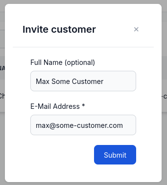
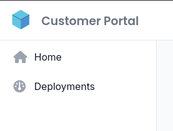
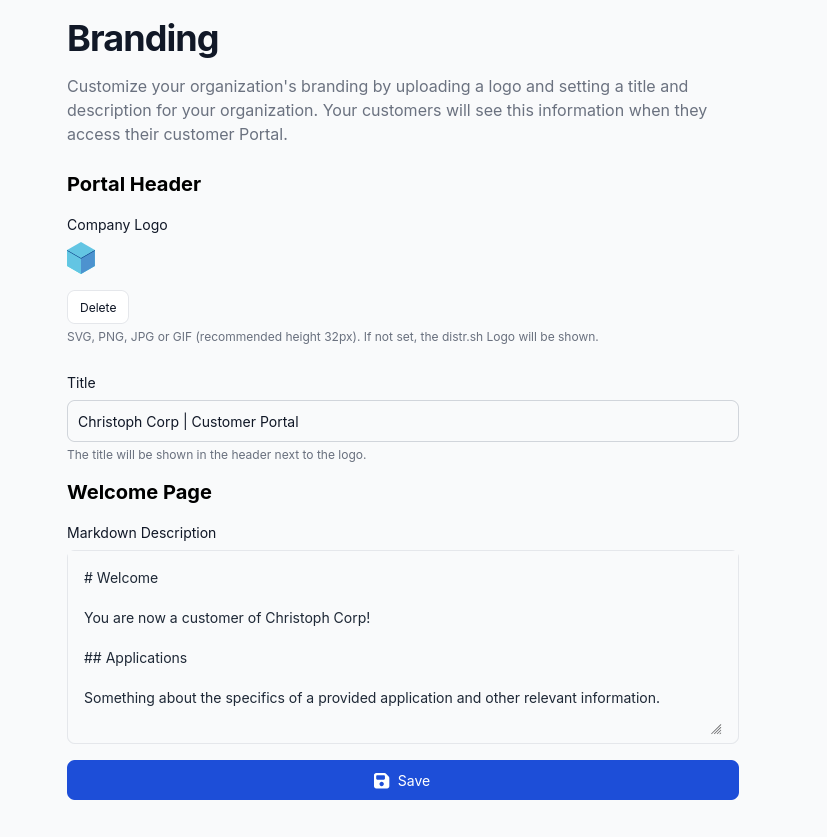
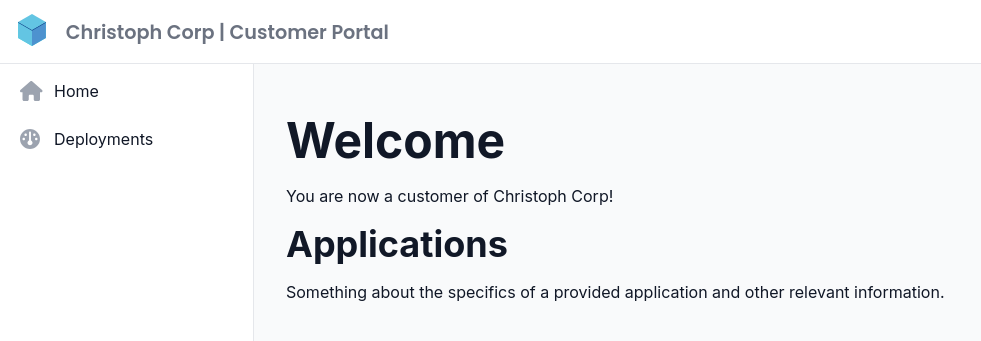

In this guide, we will walk you through the process of onboarding a new customer in Distr.

A customer is able to deploy the applications you provide. They only see their own deployment environments and can change them at any time.
Be aware that as a vendor, you cannot change the deployments of a customer-controlled environment.

## Invite a new customer to your organization

To see the list of customers, navigate to the **Customers** section in the sidebar. Initially, the list will be empty.

In the top right corner, click on the **Invite customer** button.

This will open up a small form where you can enter the name and email address of the customer you want to invite.

When clicking submit, a mail will be sent to the customer with a link to the Distr Customer Portal.

It's now your customer's turn to open the invitation mail, click the link, and set a password for their Distr user account.
They will from now on have access to the Distr Customer Portal, with that exact email address and their chosen password.

## Customer Portal

The Customer Portal allows your customers to view and manage the deployments of the applications they have purchased from you.
It looks like the Vendor Portal, but has less options and only shows the deployments of the customer.

## Optional: Branding Options

You can choose to brand the Distr Customer Portal by using your own logo and a welcome page, that can be formatted with Markdown.
This can be done in the **Branding** section of the Distr vendor portal.
Every customer will see the same branding, customer-specific branding is not supported yet.

The customer portal will now look like this:

Your logo will also be shown in the invitation email to the customer.
