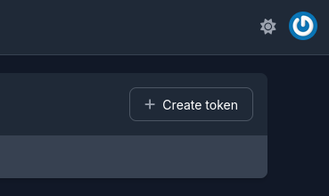
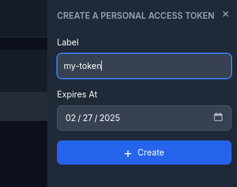
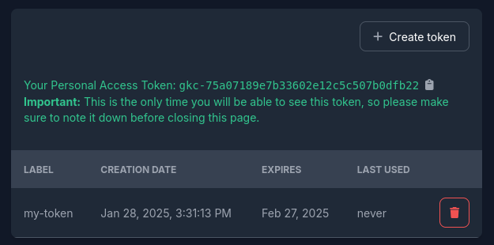

In integration scenarios, you need to authenticate with the Distr API using a Personal Access Token (PAT).
This applies for any kind of integration, no matter whether you are using the Distr SDK or interacting with the API directly.

A Personal Access Token is a unique string that you generate in the Distr web interface. It is directly associated with the user who created it.

## Creating a Personal Access Token

In the top right corner of the Distr web interface, click on your user icon and select **Personal Access Tokens** from the dropdown menu.
You can also directly access this page by navigating to [https://app.distr.sh/settings/access-tokens](https://app.distr.sh/settings/access-tokens) (make sure to replace `app.distr.sh` with your Distr instance URL if you selfhost).

The page will show you a list of already granted access tokens that are associated with your user account.

On the top right corner, click on the **Create token** button.

You will be prompted to enter a name and an expiry date for the token.
You can leave both empty, but we recommend to set a descriptive label and an expiry date to keep your tokens organized and secure.

After you have entered the details, click on the **Create** button. The token will be generated and displayed on top of the page.

This is the only time the token will be shown to you. Make sure to copy it and store it in a secure place.
Remember, anybody that has access to this token can authenticate with the Distr API on your behalf. Treat it like your password.

## Deleting Personal Access Tokens

On the same page you are also able to delete tokens. Click on the trash icon next to the token you want to delete and confirm the action.

Note that any application using this token will no longer be able to authenticate with the Distr API.
