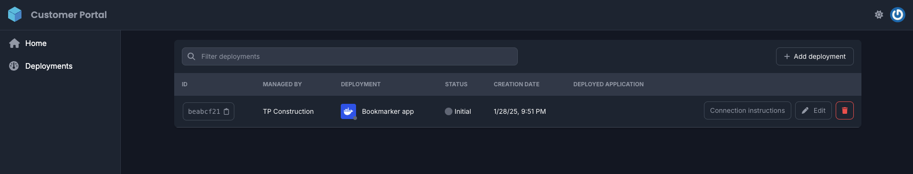
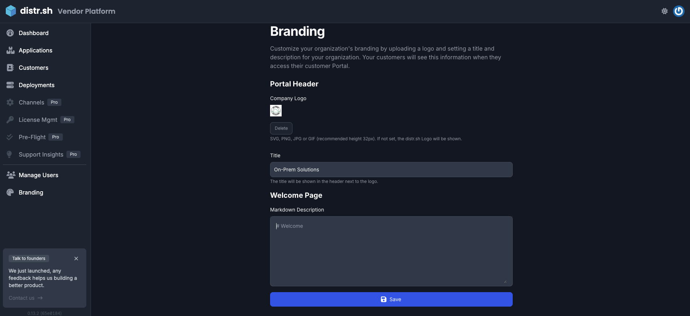
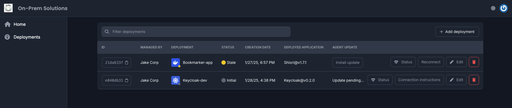

## Use Case for White-Gloving Distr

A technical stack is like a delicate house of cards, carefully constructed over time to meet a company’s evolving needs. It is created and maintained by internal engineers who work with the system daily. Most engineers, and rightly so, are cautious or have a high threshold when it comes to onboarding new tools.

As software end-customers, they’ve already made the decision to adopt the ISV’s tool and integrate it into their tech stack. However, they haven’t agreed to adopt a third-party tool (Distr) to manage the distribution of that software. This is where white-gloving becomes essential.

## What is White-Gloving?

White-gloving is the process of rebranding a third-party tool, like Distr, to match the corporate identity of the ISV. The primary goal is to reduce friction between the ISV and the end-customer. The end-customer shouldn’t feel like they’re adopting or learning an entirely new tool.

By rebranding Distr, it can look and feel like an internal ISV portal, purpose-built to help end-customers manage their deployments. This approach makes Distr feel like an extension of the ISV’s offering, simplifying the experience for the end-customer.

## What About the Forward-Deployed Distr Agents?

To further reduce overhead for the end-customer, we can work with the ISV to bundle the lightweight Distr agents directly into their base Helm chart or Docker Compose file. This ensures the agents are installed alongside the application itself.

Since end-customers will likely run vulnerability scans and other tests on the application files, the bundled agents will be included in the same process. This eliminates the need for a separate vetting process for the agents, further reducing the effort required by the end-customer while maintaining their trust.

## How to White-Glove Distr

1. In the Vendor Portal, navigate to the Branding tab in the left-hand sidebar.
2. Fill out the form with your company’s branding information.
3. Review your changes before clicking Save.

Before saving, the Customer Portal will look like this:

After saving, your end-customer will have a fully re-branded Customer Portal that looks something like this:

