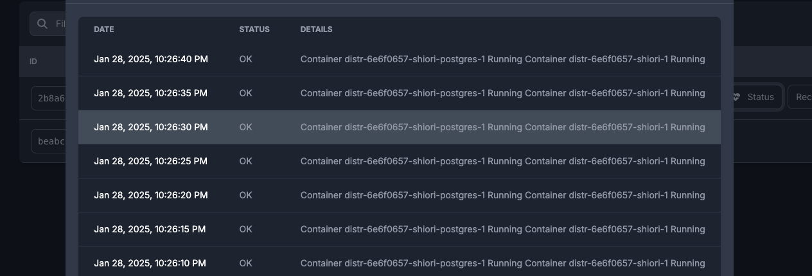
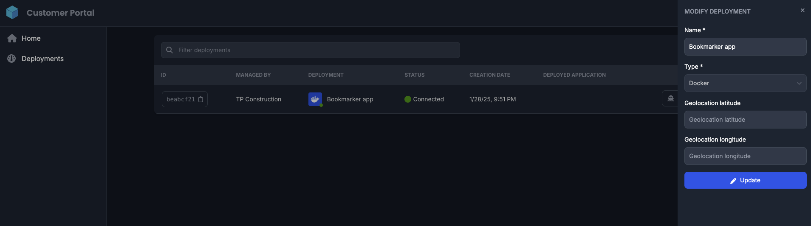
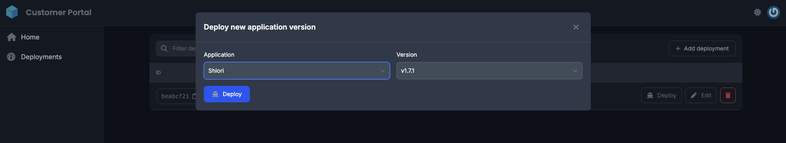

The Customer Portal provides end-customers with the essential features they need to manage the deployment of the ISV's applications. Compared to the Vendor Portal, it is intentionally more basic, following a "less is more" approach. This design philosophy acknowledges that end-customer should only care about their deployments and should not have to deal with anything else cluttering their management console.

The customer portal offers:

#### 1. Management of all deployment from a single pane

#### 2. Access to view current deployment logs

#### 3. Ability to edit deployment configurations

#### 4. Ability to deploy new versions of an application

:::info
If ever in doubt of which portal you are looking at, in the top left corner of the screen you can find the name of the portal you're currently in.
:::

The Customer Portal can be [customized](/docs/product/branding/) with the ISV's corporate logo and name, making Distr feel like an extension of the ISV's product rather than just another tool for the end-customer to adopt and learn.
