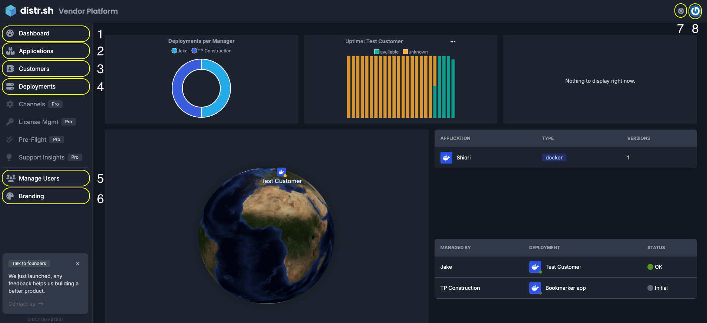
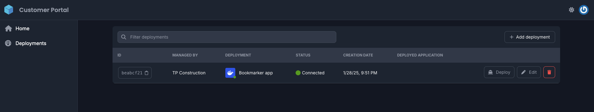
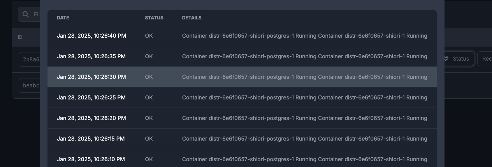
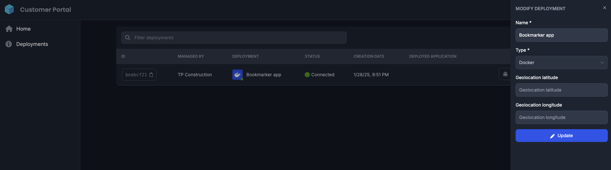
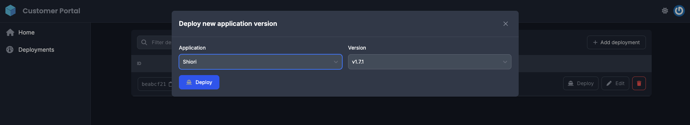

Distr Hub is made up of two user interfaces: One for Software and AI vendors and the other for their end-customers

The Vendor portal is the primary interface for interacting with the Distr hub.

Since Distr is a platform specifically built for Software and AI companies, the vendor portal serves as the gateway to access all Distr features. In contrast, the [Customer Portal](/docs/product/customer-portal/) is a simplified version of the vendor portal, designed to provide end-customers with the ability to configure and control their distributions.

The vendor portal offers:

1. A main dashboard featuring uptime metrics, graphs, and table widgets to monitor and manage applications and deployments.
2. The `"Applications"` tab, where users can add multiple applications and host multiple versions simultaneously, allowing end customers to deploy different versions as needed.
3. The `"Customers"` tab, for managing customer information.
4. Deployment management, to oversee and control internally deployed applications.
5. A section to manage the users on your team.
6. The branding section
7. A light/dark mode toggle button.
8. An account setting section.

:::info
If ever in doubt of which portal you are looking at, in the top left corner of the screen you can find the name of the portal you're currently in.
:::

The Customer Portal provides end-customers with the essential features they need to manage the deployment of the vendor's applications. Compared to the Vendor Portal, it is intentionally more basic, following a "less is more" approach. This design philosophy acknowledges that end-customer should only care about their deployments and should not have to deal with anything else cluttering their management console.

The customer portal offers:

#### 1. Management of all deployment from a single pane

#### 2. Access to view current deployment logs

#### 3. Ability to edit deployment configurations

#### 4. Ability to deploy new versions of an application

:::info
If ever in doubt of which portal you are looking at, in the top left corner of the screen you can find the name of the portal you're currently in.
:::

The Customer Portal can be [customized](/docs/product/branding/) with the vendor's corporate logo and name, making Distr feel like an extension of the software company's product rather than just another tool for the end-customer to adopt and learn.