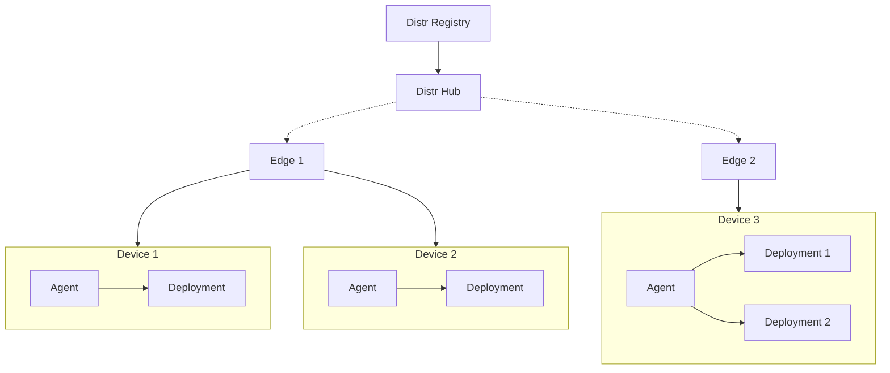

Edge Deployments enable vendors to manage software on decentralized, often resource-constrained environments that operate outside traditional data centers.
In this model, vendors maintain control of both the software and the deployment target, whether IoT devices, custom hardware, or edge infrastructure.
The lightweight nature of the Distr agents introduces little to no overhead to IoT devices on edge that often have limited resources.

